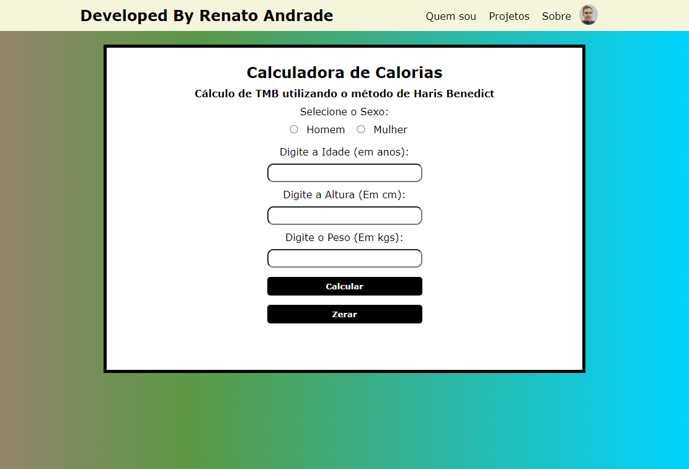

# CALCULADORA DE CALORIAS

> Calculadora de Calorias utilizando o método de Haris Benedict para calculo de Taxa Metabólica Basal.

[Clique aqui para Acessar](https://renatooandrade.github.io/calorias/)

> Tecnologias 🚀

- HTML
- CSS
- JS
- GIT E GITHUB